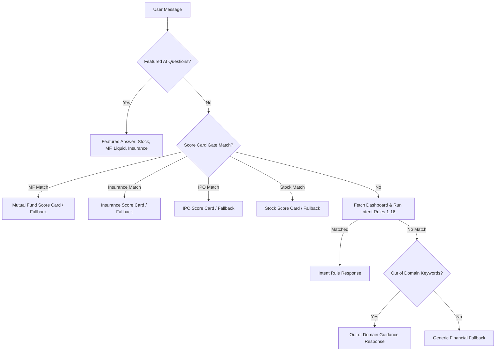

# MoneyMapper AI Assistant Specification

Technical specification for `/ai-assistant` mirroring `screens/ai_assistant_screen.dart`, `chatbot/chat_intent_service.dart`, `chatbot/chat_message.dart`, and `score_card_advisor.dart`.

---

## 1. Overview & Architecture

MoneyMapper's AI Assistant is a **deterministic, rule-and-intent-based personal finance conversational engine**.
- **NO External LLM API**: There are no external OpenAI, Gemini, Claude, or third-party LLM calls.
- **Data-Driven**: Queries the user's dashboard data via `apiService.getDashboard()`, master profile via `apiService.getMasterProfile()`, and market signal tables in `bse_data` (`stock_signals`, `mutual_fund_signals`, `insurance_plans`, `ipo_signals`).
- **Memory-Only State**: All chat messages live exclusively in component state during the user session. No message text is written to `localStorage` or `sessionStorage`.

---

## 2. Intent Rules & Matching Hierarchy

Incoming user queries pass through the following strict priority sequence:

### Keyword Word-Boundary Matching Refinements
Flutter's `chat_intent_service.dart` uses simple substring `contains()`, which results in false positives:
- `'hi'` matches inside `"achievements"`, `"which"`, `"this"`.
- `'ai'` matches inside `"explain"`, `"main"`, `"daily"`.
- `'bot'` matches inside `"bottom"`.
- `'sip'` matches inside `"gossip"`.

**Word-Boundary Rules**:
- `hi` and `hey`: `\b(hi|hey)\b`
- `ai`: `\bai\b`
- `bot`: `\bbot\b`
- `sip`: `\bsips?\b` (matches "sip" and "sips")
- `mf`: `\bmfs?\b` (matches "mf" and "mfs")
- Short out-of-domain keywords ($\le 3$ chars, e.g. `css`): `\b<kw>\b`
- All longer keywords match via substring `contains()`.

### Score Card Gate Fallthrough Protection
In Flutter, if a query triggers a gate keyword (e.g. `policy` in insurance keywords for "privacy policy", or `fund` in MF keywords for "emergency fund") but `_findBestMatch` fails to find a specific database item, Flutter halts with a "Sorry! I couldn't find that specific..." error, blocking intent rules 1..16 from ever running.

**Deviation Rule**: When `_findBestMatch` returns `null`, the score-card gate only emits a fallback error if the query does NOT match any intent rule (1..16). If an intent rule matches, it falls through to that intent rule.

---

## 3. Deviations from Flutter Mobile Reference

| Feature | Flutter Mobile Reference | Web Implementation | Rationale |
| :--- | :--- | :--- | :--- |
| **FloatingChatbot** | `floating_chatbot.dart` imported in `main.dart` | **Omitted completely** | `FloatingChatbot()` is never instantiated in Flutter's widget tree (dead code). The web assistant lives exclusively at `/ai-assistant` (the AI tab). |
| **Trial Days UI** | Hardcoded `'TRIAL: 1D LEFT'` and `"⚡ FREE TRIAL: 1-Day AI Assistant Access Active"` | Computed dynamically: `'TRIAL: {n}D LEFT'` and `"⚡ FREE TRIAL: {n}-Day AI Assistant Access Active"` using `usePlan()` / `getTrialDaysRemaining()` | The actual user trial is 7 days. Hardcoding 1 day confuses users with 7, 5, or 3 days remaining. |
| **Locked State** | `_buildLockedAiView` when `!_isAiAccessible` | Rendered when `!isPro && !isAiAccessible` ($n \le 0$) with CTA to `/subscription` | Preserves paywall locking for expired non-PRO users. |
| **Featured Question 4 (Insurance Income Honesty)** | Hardcoded `monthlyIncome = 50000` / `yearlyIncome = 600000` fallback when income is missing or $\le 0$ | When `monthlyActiveIncome` is missing or $\le 0$, omits cover numbers, prompts user: *"Add your monthly income in Master Data to get tailored cover limits"*, links to `/master-data?target=income`, and lists available plans. | Avoids inventing financial advice based on fictional income numbers. *(Note: The 10x-health and 15x-life rule is the app's internal advisory logic and should be reviewed by the product owner).* |
| **Featured Question 3 (Liquid Fund Honesty)** | Hardcoded `"Category: Debt - Liquid Scheme"` and `"Est. Annual Yield"` | Uses the fund's real category (`category ?? scheme_type ?? cluster`), and only displays return/yield when present, labelled `"1-Year Return"` (from `one_year_return`) or `"Yield"` (from `yield`). | Preserves truth in data display. |
| **No Fabricated Defaults** | Substituted fake returns (`24.5%`), scores (`82/88/84`), and mock fund names (`Parag Parikh Flexi Cap Fund`, `SBI Bluechip Fund`) when DB fields are null | **Strictly omitted**. If a field is missing, omit that bullet point. If no records exist, return an honest "Data unavailable right now" message with screener redirect. | Web data integrity standard forbids inventing financial performance metrics. |
| **Deterministic Stock Selection** | Dart uses `buyStocks[DateTime.now().second % n]` | Accepts an injectable RNG / clock index | Ensures unit and integration tests are 100% deterministic. |
| **Safe Rendering** | Flutter `RichText` with regex | React AST tokenizer parsing `**bold**` into `<strong>` and newlines into ` `. No `dangerouslySetInnerHTML`. | Guarantees complete immunity to XSS when rendering database strings. |
| **Compact Currency Formatter** | Dart `_formatCompactCurrency` in `chat_intent_service.dart` | Exported as standalone `formatCompactCurrency` in `chatIntentService.ts` matching Dart 1:1 ($\ge 10^7 \to \text{Cr}$, $\ge 10^5 \to \text{Lakhs}$, $\ge 1000 \to \text{K}$, else round). | Preserves exact Flutter formatting. |

---

## 4. Route Normalization

Chat responses emit Flutter route paths (e.g. `/emergency_fund_p`, `/stock_screener`). The web layer normalizes them:
- `/emergency_fund_p` $\to$ `/pillars/emergency`
- `/income_p` $\to$ `/pillars/income`
- `/mutual_fund_p` $\to$ `/pillars/investments`
- `/insurance_p` $\to$ `/pillars/insurance`
- `/weekly_expense_p` $\to$ `/pillars/expenses`
- `/ai` $\to$ `/insights`
- `/stock_screener` $\to$ `/stock-screener`
- `/mf_screener` $\to$ `/mf-screener`
- `/insurance_screener` $\to$ `/insurance-screener`
- `/master_data` $\to$ `/master-data`
- `/corporate_dashboard` $\to$ `/corporate-dashboard`
